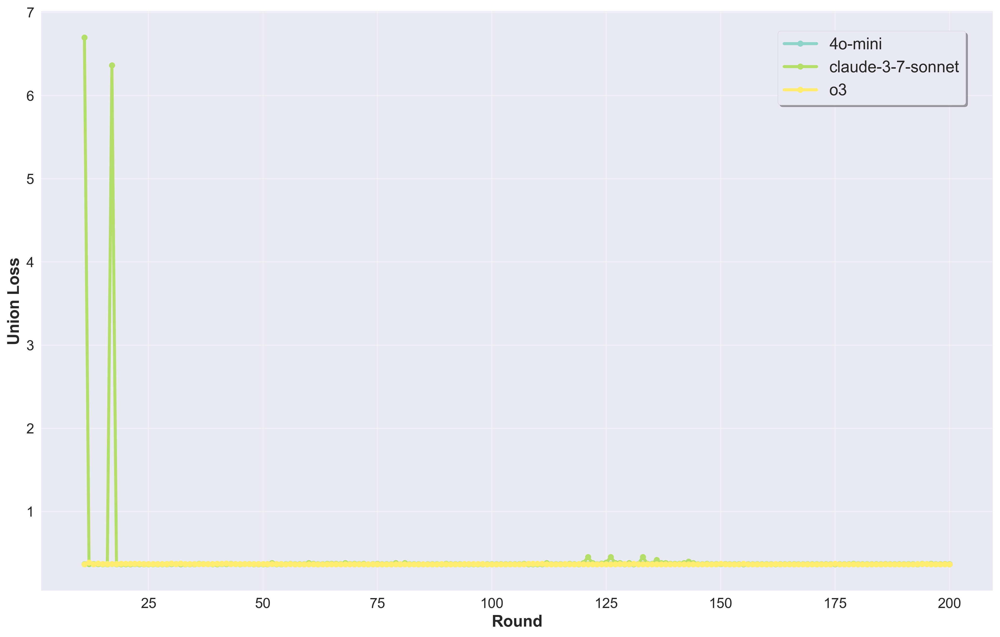
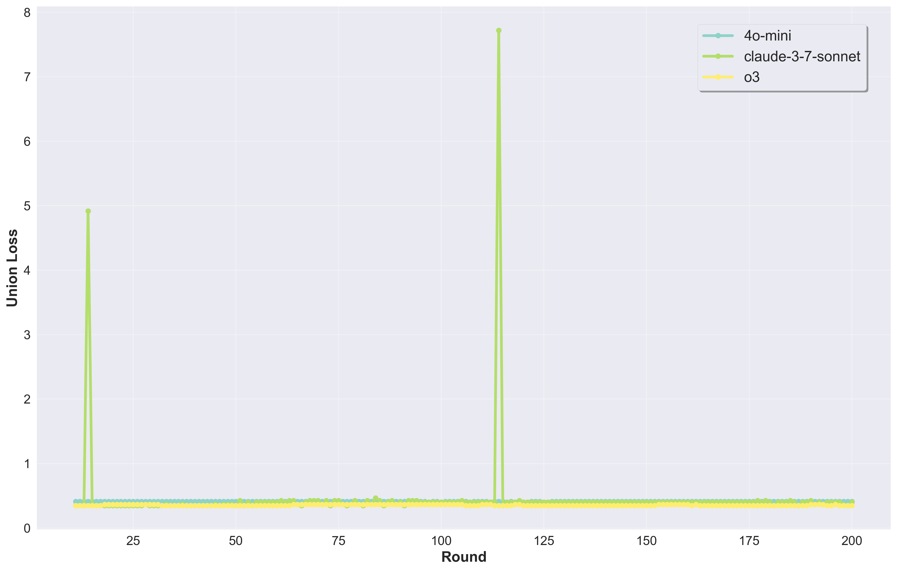
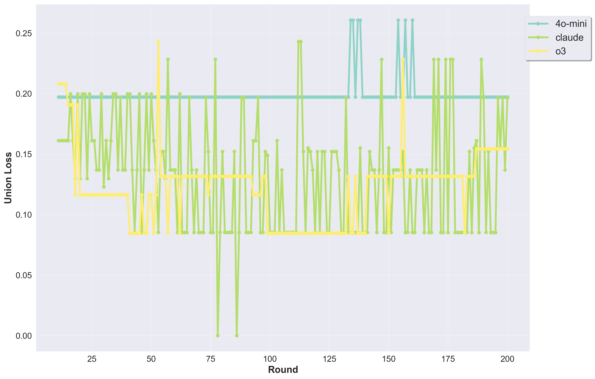

# RPS Observer: Simulating Theory of Mind in LLMs through Game Observation

[](https://arxiv.org/abs/2512.19210)
[](https://arxiv.org/abs/2512.19210)

Official implementation of the paper **"Observer, Not Player: Simulating Theory of Mind in LLMs through Game Observation"**, presented at NeurIPS 2025 Workshops on *Foundations of Reasoning in Language Models* and *Bridging Language, Agent, and World Model*.

---

## Abstract

We present an interactive framework for evaluating whether LLMs can demonstrate genuine strategic understanding. Using Rock-Paper-Scissors (RPS) as a controlled testbed, the LLM acts as an **Observer** — it watches a sequence of game rounds and must identify the hidden strategy being used by each player, along with a confidence estimate. This framing separates strategic *understanding* from strategic *acting*, enabling a cleaner probe of theory-of-mind capabilities. We introduce three complementary metrics (Cross-Entropy, Brier Score, EV Loss) unified into a single **Union Loss**, and report the **Strategy Identification Rate (SIR)** for stable strategy recognition across GPT-4o-mini, o3, and Claude 3.7 Sonnet.

---

## Overview

### The Observer Framework

```
Game History (rounds 1..t)
        │
        ▼
  ┌─────────────┐        ┌───────────────────────────┐
  │  RPS Engine │──────▶ │  LLM Observer             │
  │  (19 strats)│        │  - Identify strategy 1    │
  └─────────────┘        │  - Identify strategy 2    │
                         │  - Report confidence      │
                         └───────────────────────────┘
                                      │
                                      ▼
                            Evaluation Metrics
                         (CE / Brier / EV / Union Loss)
```

### Strategy Space

| Type | Codes | Description |
|------|-------|-------------|
| Static | A–P (16 strategies) | Fixed probability distributions over {Rock, Paper, Scissors} |
| Dynamic | X, Y, Z (3 strategies) | Reactive — behavior depends on opponent's last move |

Static strategies range from pure plays (A = pure Scissors, B = pure Rock, C = pure Paper) through random (D), binary mixtures (E–G), biased (H–J), and ordered mixtures (K–P). Dynamic strategies are: **X** (play to beat opponent's last move), **Y** (play to lose to it), **Z** (copy it).

### Evaluation Metrics

| Metric | Formula | Intuition |
|--------|---------|-----------|
| Cross-Entropy Loss | −∑ p_true · log(p_pred) | Calibration of predicted distribution |
| Brier Score | ∑ (p_true − p_pred)² | Sensitivity to probability errors |
| EV Loss | (EV_true − EV_pred)² | Payoff alignment |
| **Union Loss** | mean(CE, Brier, EV) | Unified score |
| SIR | % rounds with correct top-1 strategy ID | Discrete identification accuracy |

Losses are normalized relative to the full strategy matrix (min-max for Union; fixed upper bound for EV).

---

## Results

Experiments were run on three strategy matchups. Each folder in [`experiments/results/`](experiments/results/) contains per-model and cross-model comparison charts.

| Scenario | Player 1 | Player 2 |
|----------|----------|----------|
| [DY](experiments/results/DY/) | D — random (uniform 1/3) | Y — lose vs last move |
| [HC](experiments/results/HC/) | H — Rock-biased (0.5, 0.25, 0.25) | C — pure Paper |
| [NG](experiments/results/NG/) | N — Paper>Scissors (0.167, 0.5, 0.333) | G — Paper+Scissors (0, 0.5, 0.5) |

**Models evaluated**: `gpt-4o-mini`, `o3`, `claude-3-7-sonnet`

Cross-model Union Loss comparisons (lower is better):

| DY | HC | NG |
|----|----|----|
|  |  |  |

See [`experiments/results/README.md`](experiments/results/README.md) for a full description of all chart types.

---

## Repository Structure

```
rps_observer/
├── backend/                    # FastAPI backend
│   ├── app/
│   │   ├── main.py             # App entry point, CORS, route registration
│   │   ├── core/config.py      # Environment variables & LLM provider config
│   │   ├── api/v1/             # REST API routes
│   │   ├── domain/             # Core logic: strategies, simulator, metrics
│   │   ├── services/llm.py     # LLM provider integrations
│   │   └── schemas/            # Pydantic request/response models
│   ├── requirements.txt
│   ├── env.example
│   └── Dockerfile
├── src/                        # React + Vite frontend
│   ├── components/
│   │   ├── RPSCalculator.jsx   # Strategy matrix calculator UI
│   │   └── ObserverDemo.jsx    # Observer experiment UI with live streaming
│   └── lib/api.js              # API client
├── experiments/
│   └── results/                # Experiment result PNGs (DY / HC / NG)
├── scripts/
│   ├── observer_auto_test.py   # Batch experiment runner (CLI)
│   ├── check_env.py            # Environment validation
│   └── test_normalized_loss.py # Loss function unit tests
├── index.html
├── package.json
└── vite.config.js
```

---

## Quick Start

### Prerequisites

- Python 3.9+
- Node.js 18+, npm 9+
- API key for at least one supported LLM provider

### 1. Clone & Configure

```bash
git clone https://github.com/folivora-hi/rps_observer.git
cd rps_observer
cp backend/env.example backend/.env
# Edit backend/.env and fill in your API key(s)
```

**Supported LLM providers** (`MODEL_PROVIDER` in `.env`):

| Value | Provider | Required Key |
|-------|----------|-------------|
| `openai` | OpenAI (gpt-4o, gpt-4o-mini) | `OPENAI_API_KEY` |
| `deepseek-official` | DeepSeek Chat | `DEEPSEEK_API_KEY` |
| `deepseek-reasoner` | DeepSeek Reasoner | `DEEPSEEK_API_KEY` |
| `gemini-2.5-pro` | Google Gemini | `GEMINI_API_KEY` |
| `claude-3-7-sonnet-20250219` | Anthropic Claude | `ANTHROPIC_API_KEY` |
| `openrouter` | OpenRouter (any model) | `OPENROUTER_API_KEY` |

### 2. Backend

```bash
python3 -m venv rps
source rps/bin/activate        # Windows: rps\Scripts\activate
cd backend
pip install -r requirements.txt
uvicorn app.main:app --reload --port 8002
```

Backend API: http://127.0.0.1:8002  
Swagger docs: http://127.0.0.1:8002/docs

### 3. Frontend

```bash
# In the project root (new terminal)
npm install
npm run dev
```

Frontend UI: http://localhost:5173

---

## Running Experiments

Use `scripts/observer_auto_test.py` to batch-run observer experiments and export results to Excel:

```bash
source rps/bin/activate
python scripts/observer_auto_test.py \
  --server http://localhost:8002 \
  --true-s1 D --true-s2 Y \
  --rounds 30 \
  --warmup 5 \
  --history-limit 10 \
  --reasoning-interval 3 \
  --model 4o-mini \
  --repeats 5 \
  --out-dir ./output
```

Key parameters:

| Parameter | Description |
|-----------|-------------|
| `--true-s1/s2` | Ground-truth strategies for each player (e.g. `D`, `Y`) |
| `--rounds` | Number of game rounds per run |
| `--warmup` | Warmup rounds shown before LLM starts predicting |
| `--history-limit` | Max rounds of history shown to LLM (-1 = unlimited) |
| `--reasoning-interval` | Request LLM reasoning every N rounds |
| `--model` | LLM model identifier |
| `--repeats` | Repeat count per parameter combination |

---

## API Reference

| Method | Endpoint | Description |
|--------|----------|-------------|
| GET | `/health` | Health check |
| POST | `/api/v1/observer/run` | Run a single observer experiment |
| GET | `/api/v1/observer/stream` | Stream observer results via SSE |
| POST | `/api/v1/simulate` | Simulate strategy matchup |
| GET | `/api/v1/strategies/all` | List all 19 strategies |
| POST | `/api/v1/strategies/matchup` | Compute win/loss/draw for two strategies |
| POST | `/api/v1/strategies/matrix` | Compute full 19×19 strategy matrix |
| POST | `/api/v1/player/act` | Determine next move for a player |
| POST | `/api/v1/evaluate` | Compute evaluation metrics |

Full interactive docs: http://127.0.0.1:8002/docs

---

## Citation

If you use this code or find this work useful, please cite:

```bibtex
@article{wang2025observer,
  title={Observer, Not Player: Simulating Theory of Mind in LLMs through Game Observation},
  author={Wang, Jerry and Liu, Ting Yiu},
  journal={arXiv preprint arXiv:2512.19210},
  year={2025},
  url={https://arxiv.org/abs/2512.19210}
}
```

---

## Architecture

See [ARCHITECTURE.md](ARCHITECTURE.md) for a detailed description of the backend and frontend internals.

---

[中文版 README](README_zh.md)
